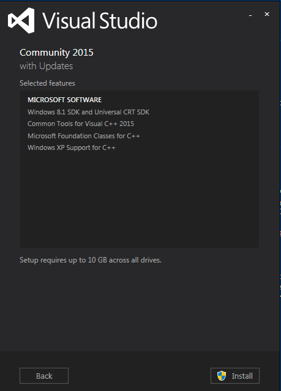

How to compile kibi native bindings
===================================

# Linux 

Use provided vagrant file.
You might want to edit node version and paths to bindings.

### For linux32 bit 

```
vagrant up ubuntu32
// check that the bindings are in native_bindings
// in case they are not ssh to the box 
vagrant ssh ubuntu32
// destroy the vm afterwards
vagrant destroy
```

### For linux64 bit 

```
vagrant up ubuntu64
// check that the bindings are in native_bindings
// in case they are not ssh to the box 
vagrant ssh ubuntu64
// destroy the vm afterwards
vagrant destroy
```


# Windows 

First meditate for some time and find your inner balance.
Once you feel you reach it do the following: 


#### Start windows vm 

#### Download the installer for correct node version

https://nodejs.org/dist/v4.3.2/node-v4.3.2-x86.msi
Verify that you have correct node version 

```
node --version
```

#### Install python 2.7 and run

```
npm config set python python2.7
```

#### Install java jdk8

#### Install Visual Studio Community 2015
Important: Check C++ support during installation
See screenshots:





NOTE:

```
If you forgot to check it you need to install:
Windows Software Development Kit (SDK) for Windows 8.1 and 
Visual C++ Compiler 
This can be done from Visual Studio
File -> New Project -> Visual C++ -> Install Visual C++ components
```
#### Set the npm property msvs_version

```
npm config set msvs_version 2015 --global
```

#### Install node-gyp globally

```
npm install -g node-gyp
```

#### Install modules 

```
npm install sqlite3@3.1.4 
npm install jdbc@0.3.1
```

#### Copy binaries to corresponding folders in kibi-internal/resources
For paths look into vagrant file 


